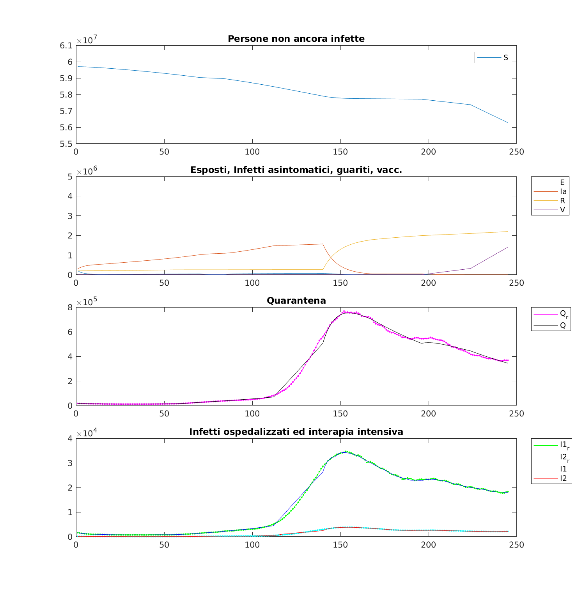
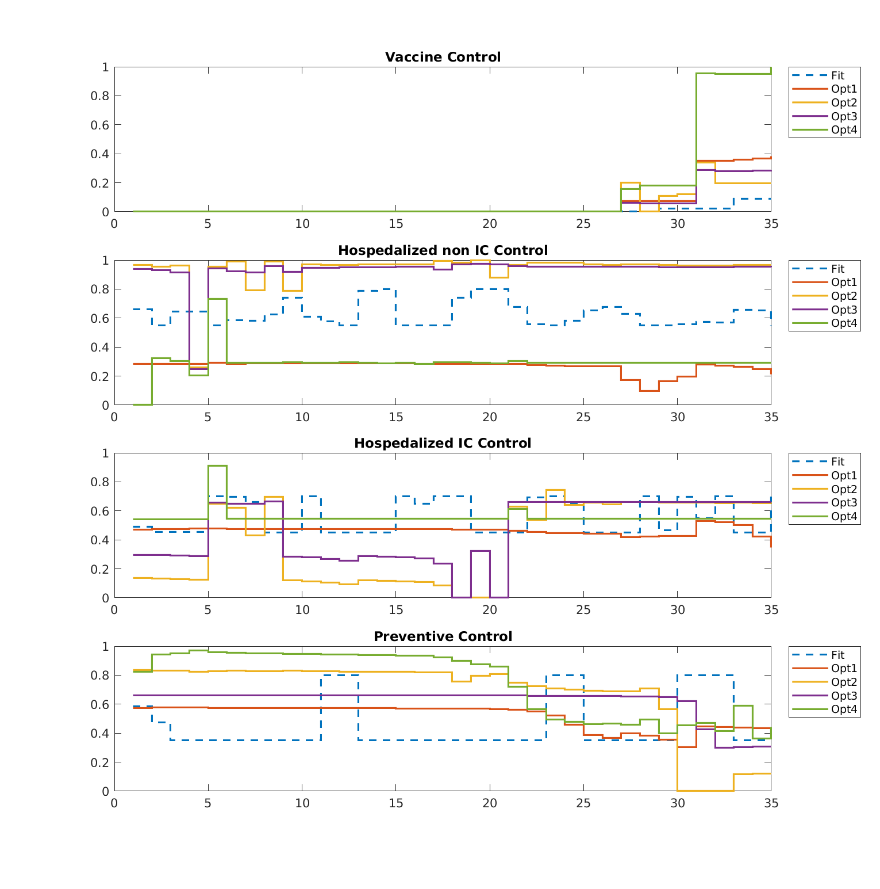

# covid-optimal-control

------------------------------

This is the git repository for the Optimal Control project.

This project is the study of the strategies to prevent the hospital beds collapse during the **Covid 19 outbreak** 

### Description

- Documents Folder
  
  - PowerPoint presentation 
  
  - Word Paper

- Matlab  Folder
  
  - Fmincon for project optimization
  
  - Optimal_Cost_hamilton for theory

- Sources Folder for some referncies

### Fitting

### Computed Controls

